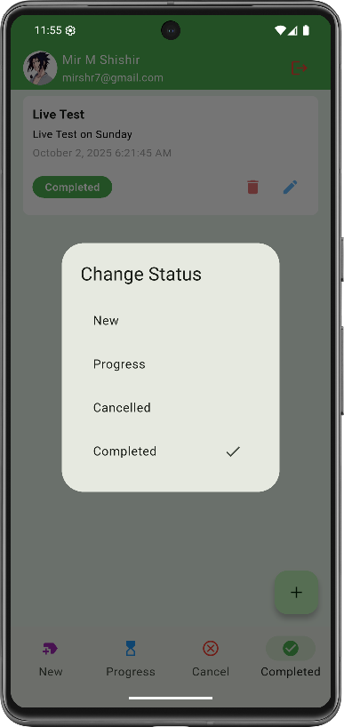

# 📌 Task Manager App

A clean, modern, and efficient **Task Manager** built with **Flutter**.  
This app helps users organize tasks, track progress, manage daily activities, and stay productive with a simple and intuitive UI.

---

## 🚀 Features

- 🔐 **Secure Login & OTP Verification**
- ➕ **Add New Tasks Easily**
- 📊 **Track Task Progress**
- 📝 **Update Profile Information**
- 🔄 **Password Reset Option**
- 📨 **Email-based Account Actions**
- 📱 **Smooth UI & Seamless Navigation**

---

## 📸 App Screenshots

### 🌟 Authentication Screens
<div align="center">

| Splash | Login | Email |
|-------|-------|------|
|  |  |  |
| Splash Screen | Login Screen | Verify Email |

</div>

---

### 🔐 Account Recovery Screens
<div align="center">

| OTP | Reset | New Task |
|----|------|----------|
|  |  |  |
| Verify OTP | Reset Password | Add New Task |

</div>

---

### 📊 Task Status Screens
<div align="center">

| Progress | Complete | Cancelled |
|----------|-----------|------------|
|  |  |  |
| In Progress Tasks | Completed Tasks | Cancelled Tasks |

</div>

---

### 👤 User Profile & Task Management
<div align="center">

| Add New | Update Profile | Edit / Delete |
|----------|---------------|----------------|
|  |  |  |
| Add New Task | Update Profile | Edit / Delete Task |

</div>

---

## 🛠 Getting Started

This project is a starting point for a Flutter application.

### Prerequisites
- Flutter SDK
- Android Studio / VS Code
- Android or iOS Emulator

### Installation
```bash
git clone https://github.com/your-username/task-manager-app.git
cd task-manager-app
flutter pub get
flutter run
