# 📌 Task Manager App

A clean, modern, and efficient **Task Manager** built with Flutter.  
This app helps users organize tasks, track progress, manage daily activities, and stay productive with a simple and intuitive UI.

---

## 🚀 Features

- 🔐 **Secure Login & OTP Verification**  
- ➕ **Add New Tasks Easily**  
- 📊 **Track Task Progress**  
- 📝 **Update Profile Information**  
- 🔄 **Password Reset Option**  
- 📨 **Email-based Account Actions**  
- 📱 **Smooth UI & Seamless Navigation**

---

## 📸 App Screenshots

### 🌟 Authentication Screens

| Splash | Login | Email |
|-------|-------|------|
| 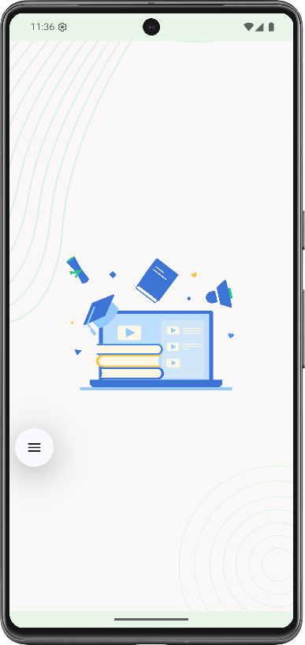 | 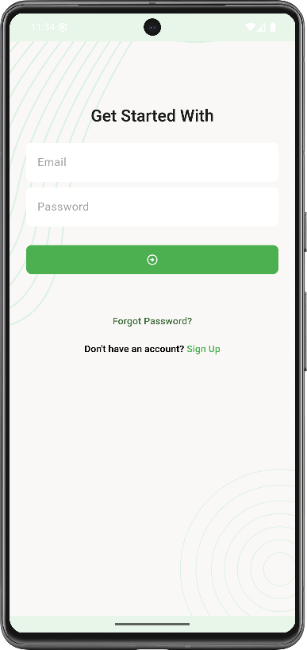 | 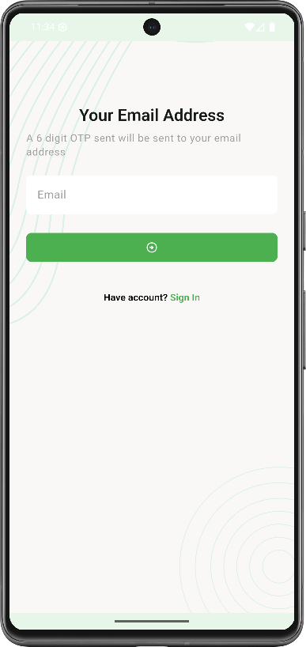 |
| Splash Screen | Login Screen |Verify Email |

---

### 🔧 Core App Screens

| OTP  | Reset | New |
|--------|------|--------|
| 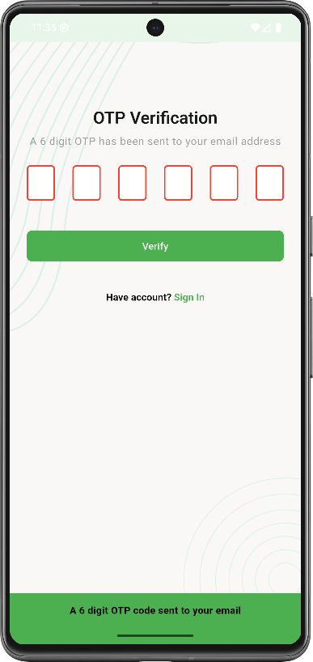 | 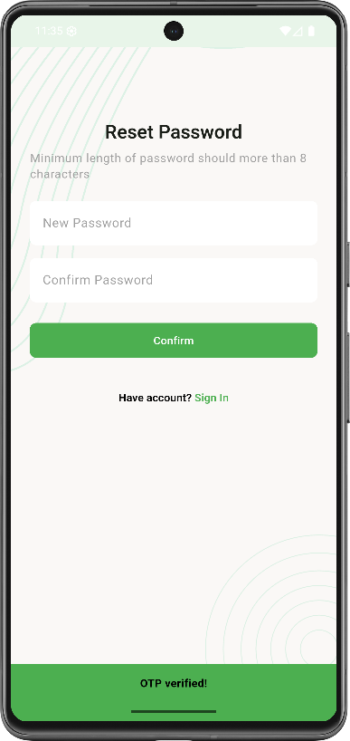 | 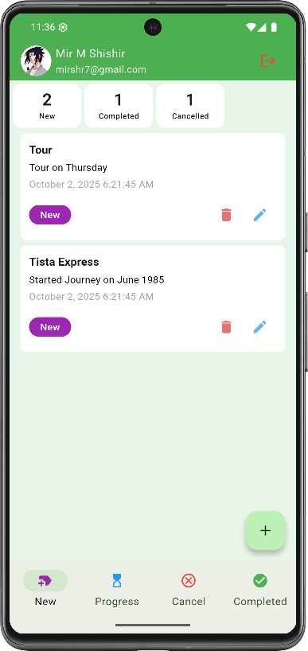 |
| Verify OTP | Reset Password | New Task |

---

### 📊 Task Status Screens

| Progress | Complete | Cancelled |
|----------|-----------|------------|
| 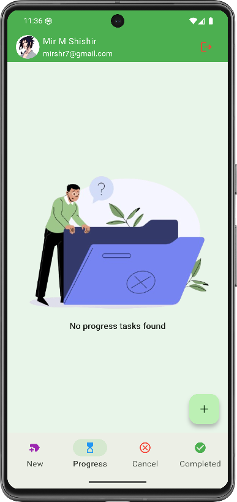 | 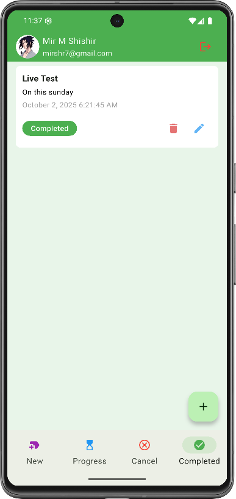 | 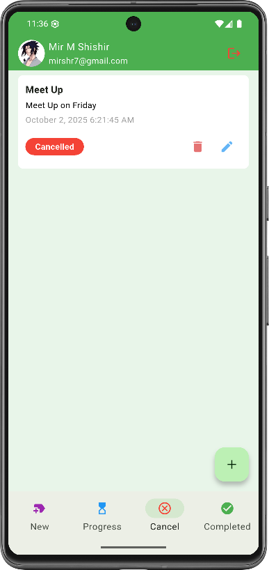 |
| In Progress Tasks | Completed Tasks | Cancelled Tasks |

---

### 👤 User Profile Screens

| Add New | Update Profile |
|----------------|----------------|
| 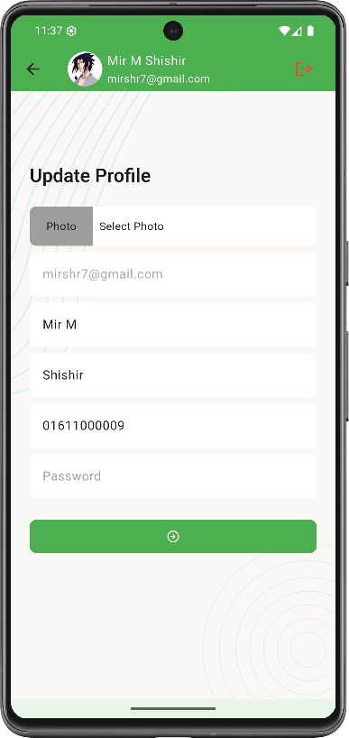 | 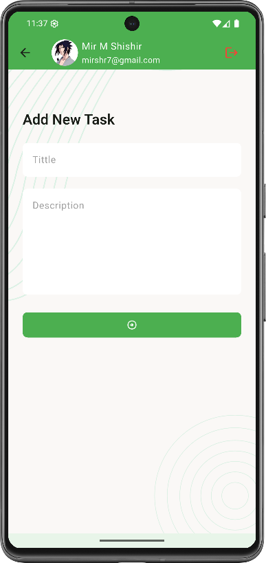 |
| Add New Task | Update Profile |

---

## 🛠 Getting Started

This project is a starting point for a Flutter application.

## 🤝 Contributing

Pull requests are welcome! For major changes, open an issue first to discuss what you'd like to change.

---

## 📄 License

This project is licensed under the **Owner**.

---

Made with ❤️ using Flutter.
